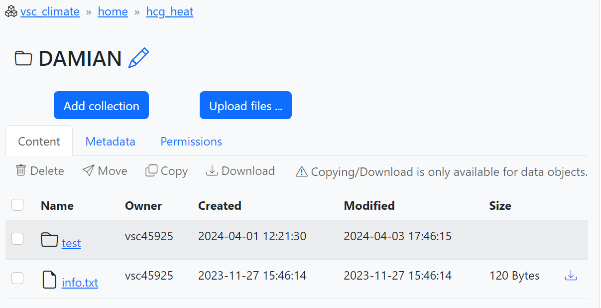
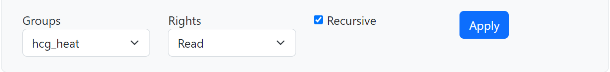
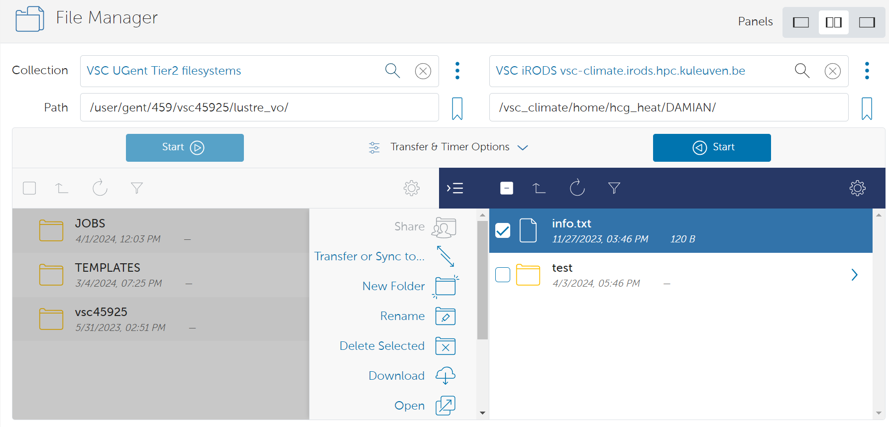
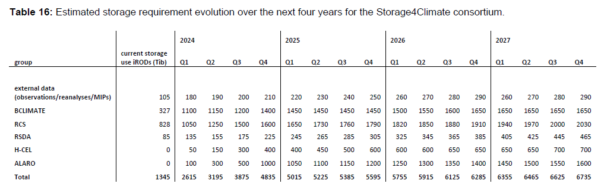

# User's guide to get started with Tier-1

The VSC Tier-1 computing iTo log inproject should be able to access the "hcg_heat" repository. Obviously,you must use your UGent credentials, usinGlobus nThe Storage4Climate project has a storage capacity of ~5PB in Tier-1 Data ("storage4climate" repository). H-CEL can only access a small part of that storage but still the resources are comparable to what we currently have in Tier-2 (400TB by the end of 2024). Additionally, H-CEL has 200TB available for the HEAT project in the "hcg_heat" repository.y allows you to transfer, but also to create, rename, delete or download directories (toolbar in the central part of the image above). However, it should be noted that the "storage4climate" folders, even the ones we created, belong to another user (HPC staff). This means that we will not be able to delete them. From ManGO we will not even get the option to delete them and from Globus we can launch a job to do it, but we will get an error.ink "Partner organizations: VSC account". Then you must click on "Enter Portal" to access the iRODS vsc-climate zone.

Once inside you should be able to see the different repositories you are a member of. Everyone should be able to see a repository called "public" and another called "storage4climate". Additionally, members of the HEAT project should be able to access the "hcg_heat" repository. Obviously, the latter is intended exclusively for HEAT project data, so all data associated with other projects should be stored in the "storage4climate" repository. If you do not have access, ask to be added.re consists of [three components](https://www.vscentrum.be/tiering): Tier-1 Compute, Tier-1 Data and Tier-1 Cloud. Here we focus on describing the first two, which are the components to which we have access.

## Tier-1 Compute

## Tier-1 Compute

As its name suggests, it is designed for computation, which is performed in the [*Hortense*](https://docs.vscentrum.be/gent/tier1_hortense.html) cluster, hosted by Ghent University, and maintained and supported by the HPC-UGent team. *Hortense* has an internal name called *dodrio*.

Connecting to *Hortense* is analogous to connecting to any of the Tier-2 clusters:

```bash
ssh -X vscXXXXX@tier1.hpc.ugent.be
```

Where vscXXXXX is your username.

The use of Tier-1 is necessarily associated with a project, in our case the Storage4Climate project. All projects can be consulted using the environment variable `$VSC_SCRATCH_PROJECTS_BASE`. The directory associated with our project is **2022_200**, which is where we should work. To this end, enter the folder:

```bash
cd /dodrio/scratch/projects/2022_200/project_output/hcel
```

And create a working directory with your username:

```bash
mkdir vscXXXXX
```

All your computations should be performed from that directory. The reason for this is that the storage space on `$VSC_SCRATCH` (personal scratch directory) is very limited. Therefore, you have to be located inside the **2022_200** folder to access the project storage space. The Storage4Climate initiative has approximately 40% of the storage available at *Hortense* (~2PB). However, Tier-1 Compute is not intended for long-term data storage, which means that data should be moved to Tier-1 Data as soon as possible.

It is useful to link that working directory to your home directory, which in Tier-1 *Hortense* corresponds to your personal scratch directory (`$VSC_SCRATCH`):

```bash
cd $VSC_SCRATCH
ln -s /dodrio/scratch/projects/2022_200/project_output/hcel/vscXXXXX scratch_s4c
```

So every time you enter Tier-1 *Hortense* you can access it by simply executing:

```bash
cd scratch_s4c
```

On the other hand, when sending jobs to queues in *Hortense*, we only need to include one more line in the header:

```bash
#PBS -A 2022_204
```

Which indicates our subproject (**2022_204**), or in other words, the code associated with H-CEL. Before submitting jobs to the queue, we need to go to the cluster partition where we have reserved the compute (**cpu_milan**).

```bash
module swap cluster/dodrio/cpu_milan
```

The total computing capacity for the Storage4Climate project is 54252272 CPU hours in 2024, of which only 130000 are available to H-CEL members. Still, this is a high computational capacity and could be increased in 2025.

Finally, note that the modules installed in Tier-1 *Hortense* may not be the same as those installed in Tier-2 clusters, which could cause incompatibilities with your applications.

## Tier-1 Data

[Tier-1 Data](https://docs.vscentrum.be/data/tier1data/introduction.html#tier-1-data-architecture) is intended for massive data storage. The service is based on the open source software iRODS. This means that we cannot access it through an SSH client, such as Tier-1 Computation or Tier-2, but have to use other clients. There are different options of which here we describe the ManGO and Globus clients, which should be sufficient to manage and transfer data in Tier-1 Data.

### ManGO Portal

The [ManGO portal](https://docs.vscentrum.be/data/tier1data/clients/mango_portal.html) is a graphical web interface for Tier-1 Data. It allows users to manage their data in an intuitive way, without any installations.

To log in you must use your UGent credentials, using the link "Partner
organizations: VSC account". Then you must click on "Enter Portal" to
access the iRODS vsc-climate zone.

Once inside you should be able to see the different repositories you are
a member of. Everyone should be able to see a repository called “public”
and another called “storage4climate”. Additionally, members of the HEAT
project should be able to access the “hcg\_heat” repository. Obviously,
the latter is intended exclusively for HEAT project data, so all data
associated with other projects should be stored in the “storage4climate”
repository. If you do not have access, ask to be added.

When you access one of these repositories for the first time, you may
need to create a new collection to store your data by clicking on “Add
collection” (see number 1 in the screenshot below). Collections are
similar to a regular directory, but with the ability to add metadata,
i.e., information describing the contents of the collections, and a
simple permissions management (2). This makes it easier to share data
with other users. If you do not add permissions no other person will be
able to see your content in the repository. It would be advisable to at
least add read rights with the “Recursive” option. (3). The name of the
new collection should be recognizable. In “storage4climate” you should
organize the data in the “external” and “project\_input” folders, but
there is no clear rule on how to do it so simply create a collection
when and where you think it is most suitable for you to store your data.
In the case of "hcg_heat", you could simply create a collection with
your name or your username. You can later modify the name of your new
collections if you wish by clicking on the pencil next to the name (4).





Finally, if you are the manager of one of the repositories you can add
new users through your profile (username in the upper right corner),
clicking on the desired repository and then on "Project details" and
"Add member". You can find more detailed information in this
[link](https://docs.vscentrum.be/data/tier1data/clients/mango_portal.html).

### Globus data sharing platform

[Globus](https://www.globus.org/) enables high-performance data transfer between systems within the same organization or between organizations. It is a fast, secure, and reliable way to move MB's, TB's and even PB's of data.

To log in you must search for "UGent" in the organizations search engine, click "Continue" and then use your credentials. Once inside you will be able to split the screen into 2 panels (see 1 in the screenshot below) and select two "Collections" (2) between which you want to share data. For example, to share data between your Tier-2 and Tier-1 Data accounts you should select the "VSC UGent Tier-2 filesystems" collection on one panel and the "VSC iRODS vsc-climate.irods.hpc.kuleuven.be" collection on the other (see this [link](https://docs.vscentrum.be/globus/collections.html) for all available collections). Once selected you can browse through your folders by simply clicking, as usual. To transfer files or folders between the two systems, check the box to the left of the file and folder names (3) and click "Start" (4). Note that the file or folder will be moved to the directory where you are currently located on the destination server. You can find all the information in this [link](https://docs.vscentrum.be/globus/index.html).



Globus not only allows you to transfer, but also to create, rename, delete or download directories (toolbar in the central part of the image above). However, it should be noted that the "storage4climate" folders, even the ones we created, belong to another user (HPC staff). This means that we will not be able to delete them. From ManGO we will not even get the option to delete them and from Globus we can launch a job to do it, but we will get an error.

The Storage4Climate project has a storage capacity of ~5PB in Tier-1 Data ("storage4climate" repository). H-CEL can only access a small part of that storage but still the resources are comparable to what we currently have in Tier-2 (400TB by the end of 2024). Additionally, H-CEL has 200TB available for the HEAT project in the "hcg_heat" repository.


